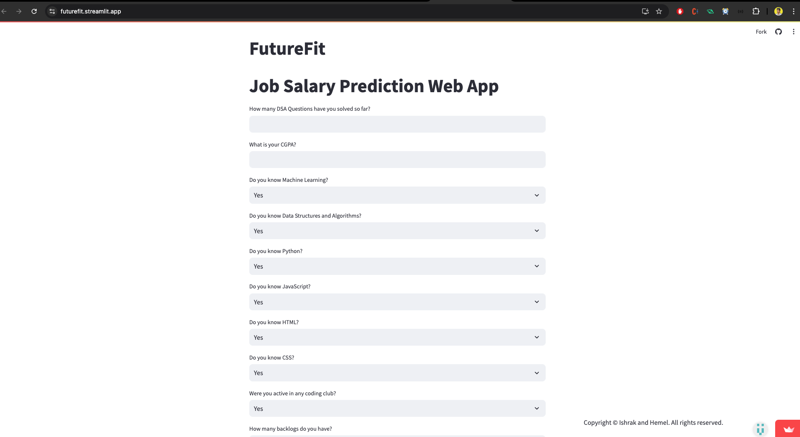

## 1. Project: Check the FutureFit Project which you can find in my Repository 
#### 1.1 FutureFit

  
   
   
  Figure 1:Project

## 2. Lab Assignments:
 assignment1: Dicision Tree & Random Forest
 assignment2: Gradiant Boosting 
 assignment3: Regression
 assignment4: K-means Clustering

## 3. Theory Lecture Outline
- Week 1 Introduction to Machine Learning, Random Forest
- Week 2 Gradient Boosting: Regression, Classification
- Week 3 Linear Prediction: Linear Regression (Lasso, Elastic Net), Logistic Regression
- Week 4 Support Vector Machines (SVC: Linear and Kernel-trick)
- Week 5. Probabilistic ML Models: NB, GNB, GMM
- Week 6. Unsupervised Learning: Clustering (K-means, Fuzzy C-Means), DBSCAN
- Week 7. Mid-Week
- Week 8. Data Dimensionality Reduction ( LDA, and tSNE)
- Week 9. Model Assessment and Performance Metrics: Classification, Clustering and Regression
- Week 10. Artificial Neural Networks: Perceptron, MLPs, and Backpropagation
- Week 11. Deep Neural Networks: CNN, LSTM
- Week 12. Final Exam
